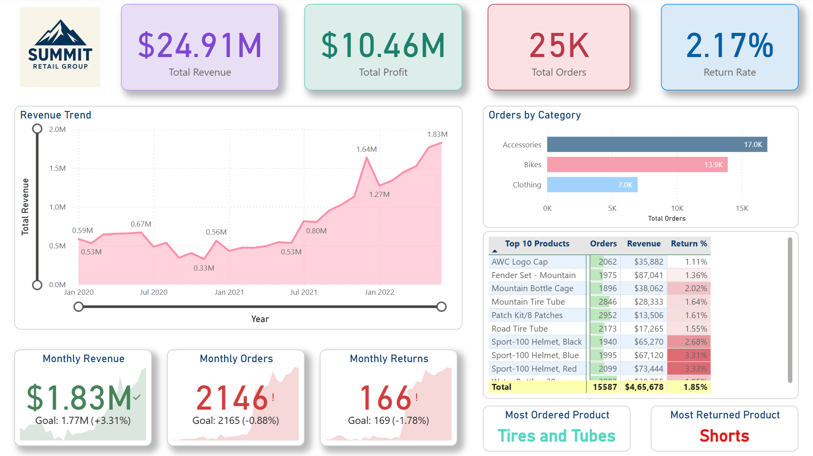
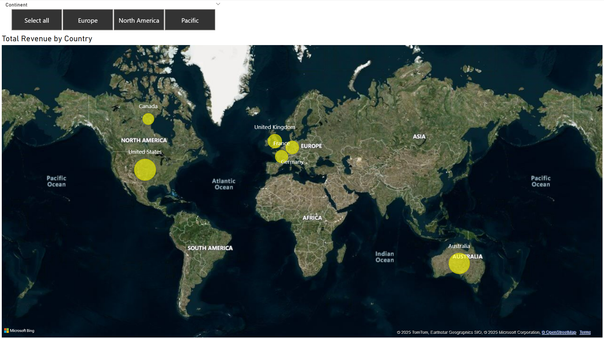
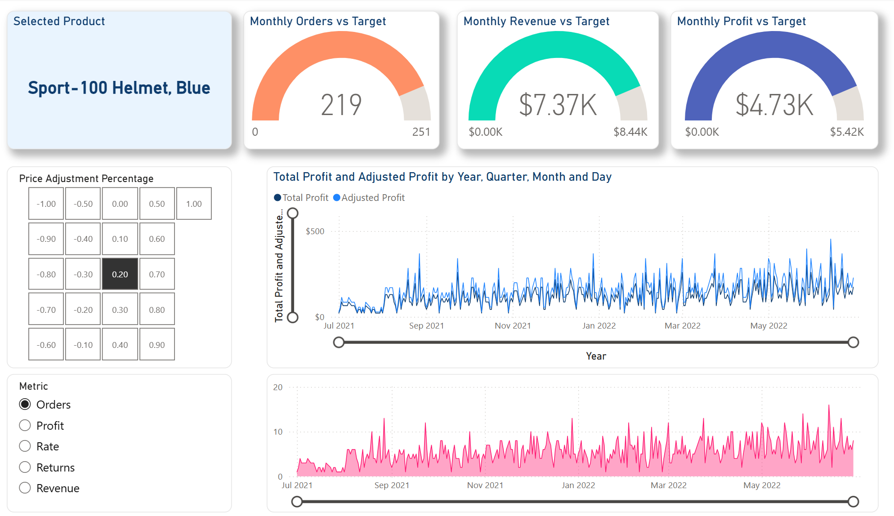
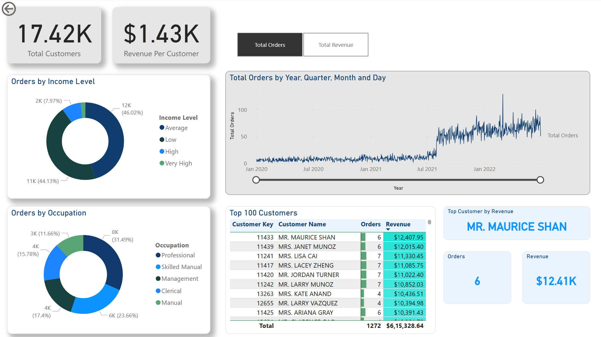

# *Summit Retail Group* - Power BI Executive Dashboard
## Sales & Marketing – “Global Sales Performance & Forecasting Dashboard”
A business intelligence dashboard developed in Microsoft Power BI for the fictional bike manufacturer, *Summit Retail Group* (A fictional Compnay).

A Microsoft Power BI business intelligence dashboard created for Summit Retail Group, a fictional global manufacturing company specializing in cycling equipment and accessories.

The dataset was provided through the Maven Analytics Power BI Desktop course, derived from Microsoft’s sample databases.

Summit Retail Group’s customer base spans six countries across three continents: Australia, Canada, France, Germany, the United Kingdom, and the United States. The dataset covers sales and return transactions between January 1, 2020, and June 30, 2022, along with detailed customer profiles including demographics, annual income, education, number of children, occupation, and homeowner status.

# Summit Retail Group - Power BI Dashboard

A Microsoft Power BI business intelligence dashboard created for **Summit Retail Group**, a fictional global manufacturing company specializing in cycling equipment and accessories.  

This project demonstrates data modeling, DAX calculations, and interactive dashboard design using Microsoft Power BI.  

---

## 📊 Features

- Track key performance indicators (KPIs) for **sales, revenue, profit, and returns**  
- Compare performance across **different regions**  
- Analyze **product-level sales trends**  
- Identify and segment **high-value customers**  

---

## 🛠️ Project Highlights

This project included:  

- Connecting and transforming raw data  
- Designing a relational data model  
- Creating calculated columns and measures using **DAX**  
- Building a rolling calendar with **Power Query (M code)**  
- Developing an interactive, multi-view dashboard  

---

## 📂 Dashboard Elements

### Executive Summary View
- High-level KPIs for revenue, profit, orders, and return rates  
- Page-level filters for products and categories  
- Drill-through capability to product-level detail

### Map View
- Total orders by country
  

### Product Detail View
- Product performance against order, revenue, and profit targets  
- "What-if" analysis via price adjustment to model impact on profit
    

### Customer Detail View
- Total customer and per-customer revenue analysis
   

### Custom UI Enhancements
- Filter pane for year and geography  
- Custom tooltips for product category metrics  

---

## 🔎 Key Insights

### Revenue & Profit
- Generated **~$24.91M in revenue** and **~$10.46M in profit** between Jan 2020 – Jun 2022  
- Revenue dipped between Jun–Nov 2020 (likely simulating COVID-19 impact), followed by steady growth  
- December 2021 saw exceptional revenue of **$1.64M** (possibly from a seasonal campaign such as Black Friday)  

### Product Trends
- **Tires and tubes** were the most ordered products  
- **Cycling shorts** had the highest return rate  
- **Mountain bike fenders** and **sports helmets** contributed significantly to revenue, despite high returns  
- **Clothing and accessories** were the most profitable categories  

### Customer Behavior
- ~200 new customers per week added starting Aug 2021  
- Revenue per customer has been **declining year over year**  

### Regional Performance
- **United States** led in volume: 8,700 orders and $7.94M revenue  
- **Australia** had the highest revenue per customer: **$2,131**  

---

## 🚀 Tools & Technologies
- Microsoft Power BI  
- DAX (Data Analysis Expressions)  
- Power Query (M code)  
- Relational data modeling  

---

## 📌 About
This project was developed as part of the [Maven Analytics Power BI Desktop course](https://www.mavenanalytics.io).  
The dataset is derived from Microsoft sample databases and adapted for learning purposes.  

---
